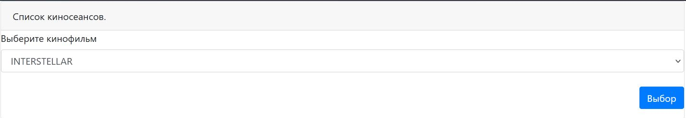
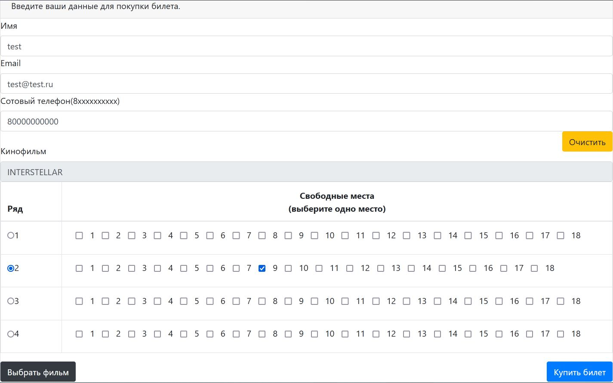
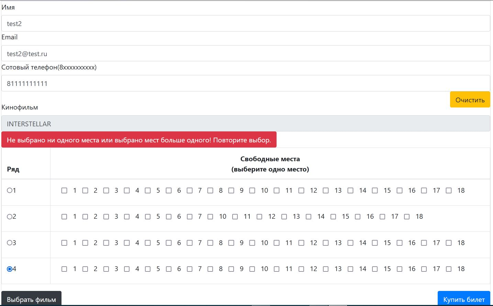
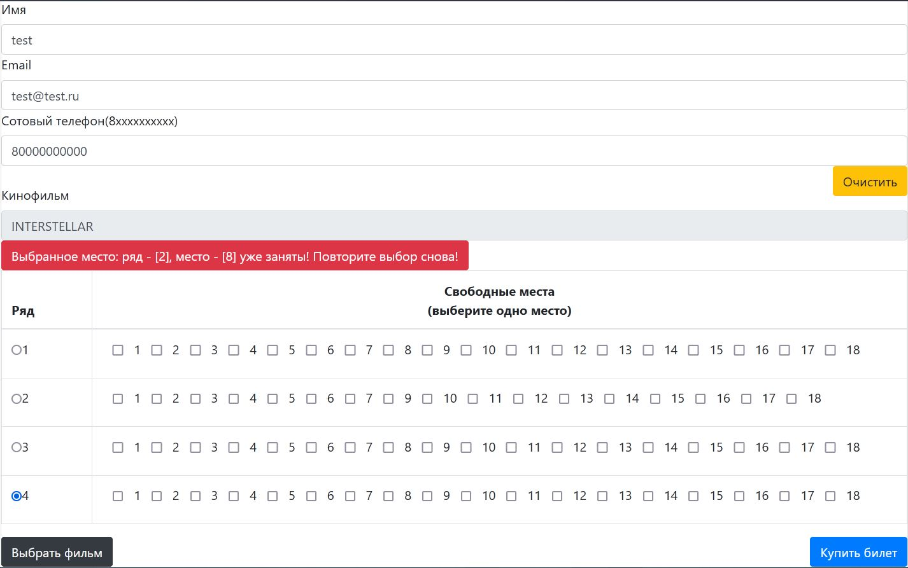
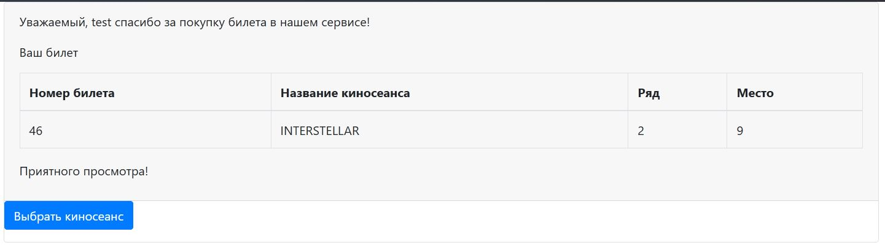

Это учебный проект по разработке сайта для покупки билетов в кинотеатр.

В файле настроек приложения задаётся вместимость кинозала:
- rows.count (количество рядов)
- cells.count (количество мест в ряде)

Предполагается, что количество мест в ряде одинаково для любого ряда.

Начальная страница сервиса /sessions позволяет выбрать киносеанс из доступного списка кинофильмов:

Главная страница сервиса /index реализована в виде формы.
В полях формы пользователем вводятся данные, необходимые для покупки билета:

Поля формы: "Имя", "Email", "Cотовый телефон", - имеют минимальный функционал валидации вводимых данных.

Поле формы "Свободные места" имеет функционал валидации на предмет некорректного выбора места:
- не выбрано не одного места;
- выбрано мест больше одного.

В указанных выше случаях высвечивается предупреждение, и пользователю представляется
возможность повторно выбрать место:

Если в момент отправки данных формы оказывается, что указанные места уже забронированы
другим пользователем, высвечивается предупреждение, и пользователю представляется
возможность повторно выбрать место:

После успешной отправки данных на сервер, данные о пользователе и о забронированном билете
заносятся в базу данных, и пользователю выводится информация о билете /ticket:

Используемые технологии:
- Spring boot.
- Thymeleaf.
- Bootstrap.
- JDBC.
- СУБД: PostgreSQL.
- Тестирование: Junit4, Liquibase, h2db.